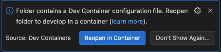

# Kommunale Investeringer

## Usage

You can start the application on your local machine by running:
`docker compose up --build`.

Your application will be available at <http://localhost:8501>.

### Deploying your application to the cloud

First, build your image, e.g.: `docker build -t myapp .`.
If your cloud uses a different CPU architecture than your development
machine (e.g., you are on a Mac M1 and your cloud provider is amd64),
you'll want to build the image for that platform, e.g.:
`docker build --platform=linux/amd64 -t myapp .`.

Then, push it to your registry, e.g. `docker push myregistry.com/myapp`.

Consult Docker's [getting started](https://docs.docker.com/go/get-started-sharing/)
docs for more detail on building and pushing.

## Contributing

Open the provided [devcontainer] in Visual Studio Code. The container includes
all the necessary tooling needed to develop, build and deploy the application.

### Using Devcontainers

From [containers.dev]:

> A development container (or dev container for short) allows you to use a
> container as a full-featured development environment.

When you opent the repository folder in Visual Studio Code, you are prompted to
_Reopen in Container_.



Doing this will build and activate a local Dev Container with the necessary
tooling to develop the application. The source code is automatically mounted
into the running container. If you start a terminal inside Visual Studio Code,
it will likewise be to a shell running inside the container.

The dev container is defined in [devcontainer.json](.devcontainer/devcontainer.json).
To learn more about configuring dev containers see [containers.dev].

#### SSH agent

If you're using SSH to check out your code from Github, the dev container will
automatically pick up and use any SSH keys in the `SSH agent`.

To add your keys to the SSH agent, you need to run `ssh-add` at the terminal
before starting Visual Studio Code.

On Windows, you may need to start the agent manually:

* Open the `Terminal` app
* Start a new `Powershell` tab as `Administrator`
* Run the following commands:
  
  ```shell
  Set-Service ssh-agent -StartupType Automatic
  Start-Service ssh-agent
  Get-Service ssh-agent
  ssh-add
  ```

These steps only needs to be performed once.

On MacOS, the SSH agent is already running. Simply run `ssh-add` in the terminal
before starting Visual Studio Code.

See [Microsoft's SSH credentials] guide for more
information.

## References

* [Docker's Python guide](https://docs.docker.com/language/python/)
* [containers.dev]
* [Microsoft's SSH credentials]

[containers.dev]: https://containers.dev/
[Microsoft's SSH credentials]: https://code.visualstudio.com/remote/advancedcontainers/sharing-git-credentials
